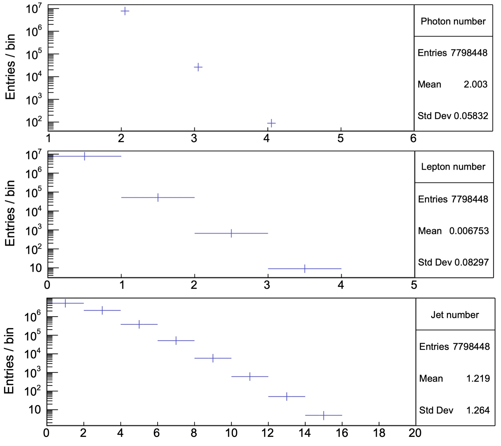

# Higgs decaying to diphoton

This repository is based on Third Year lab work at the University of Manchester studying the Higgs decaying to diphoton. The original data are from [ATLAS Open Data 13 TeV](http://opendata.atlas.cern/release/2020/documentation/index.html). 

The codes in this repository are the author's original work. Please note that this experiment heavily relies on backend code written by senior students, and the author has no authority to publish those codes.

Some plot results are shown in the next section.

## Gallery

### Variables of interest

