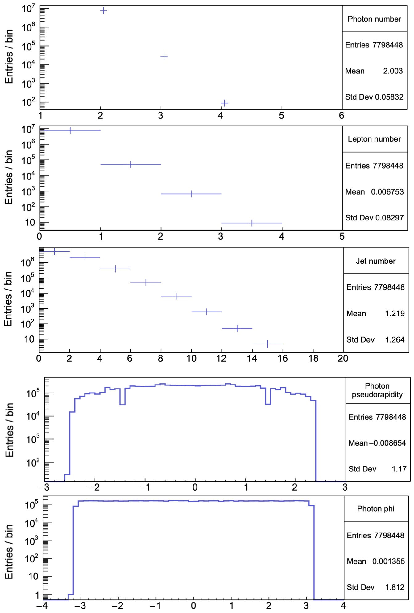
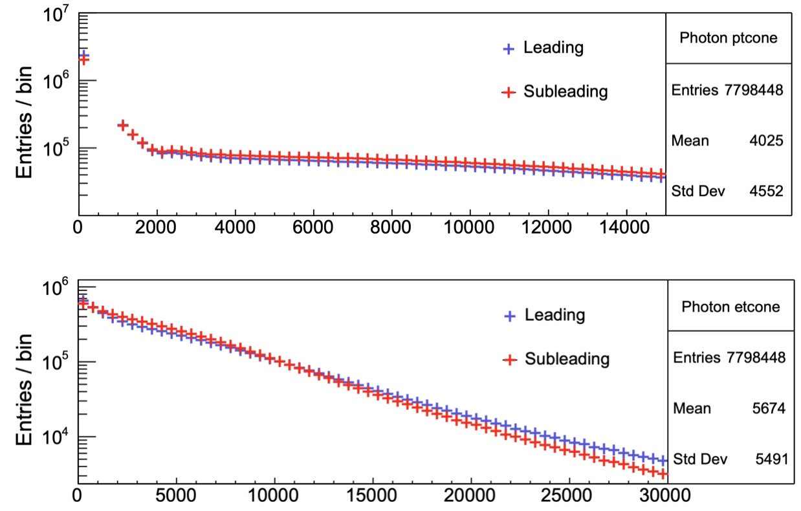
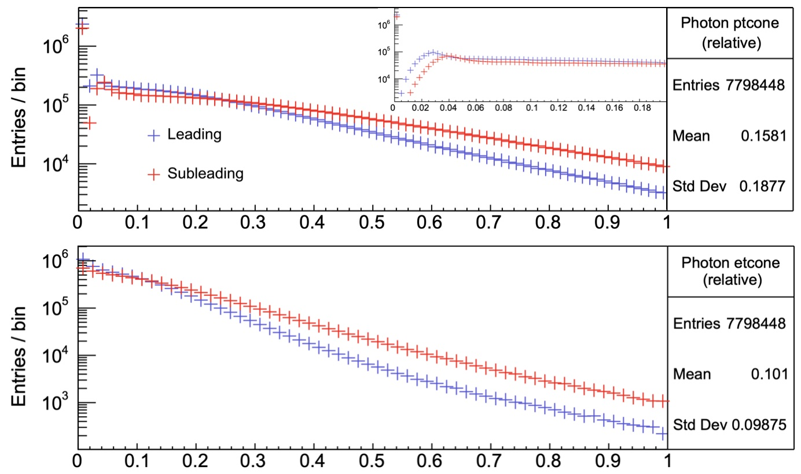
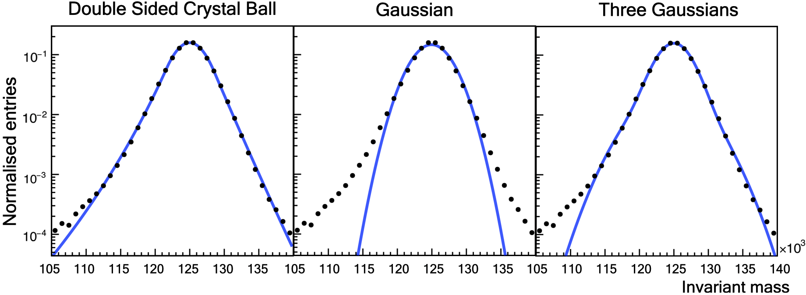
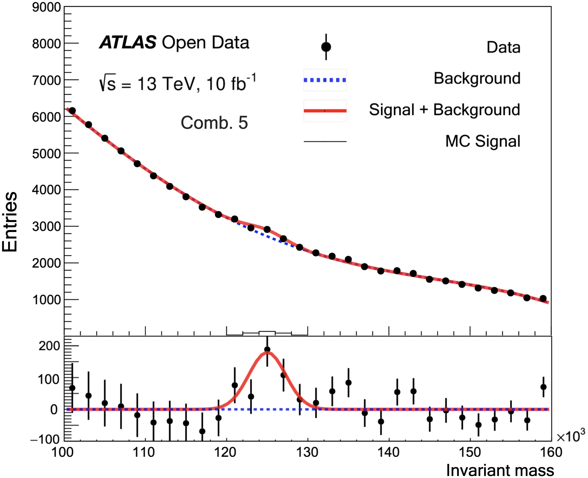
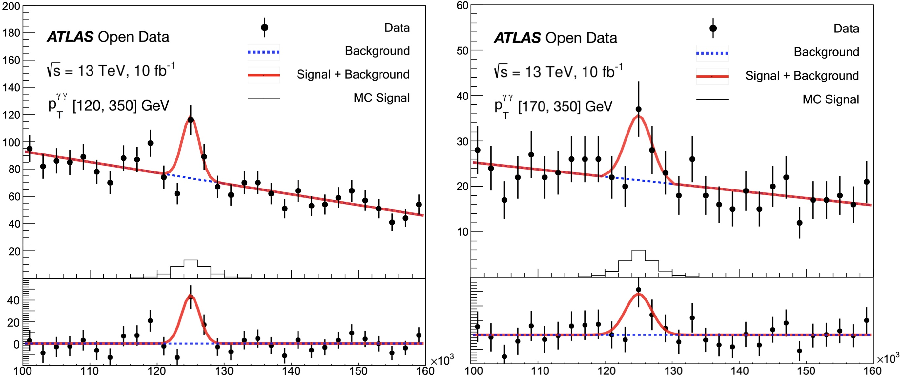

# Higgs decaying to diphoton

This repository is based on Third Year lab work (5 weeks of lab work) at the University of Manchester studying the Higgs decaying to diphoton. The original data are from [ATLAS Open Data 13 TeV](http://opendata.atlas.cern/release/2020/documentation/index.html). 

## Gallery

### Variables of interest

(Some labels are missing)

### Signal modelling

### Final plots

